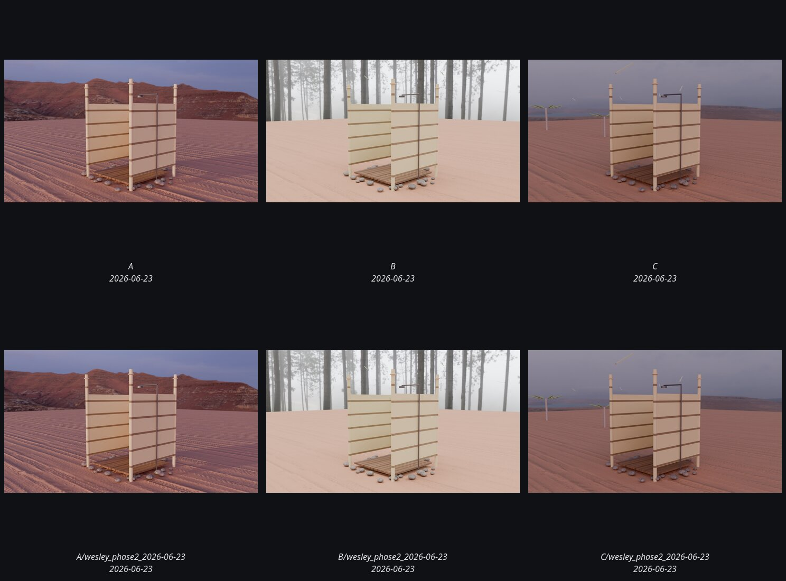

# bamboo_outdoor_shower

Total renders: **9**.

_Contact sheet above shows up to 9 latest renders, deduped by variant._

Grouped by run (date + tag), then variant.

## (undated) · flat_latest

| Variant | Path | Size | mtime | Source |
|---|---|---:|---|---|
| `A` | [`renders/sub/bamboo_outdoor_shower_A.png`](../../../renders/sub/bamboo_outdoor_shower_A.png) | 4.8MB | 2026-06-23 | sub_flat |
| `B` | [`renders/sub/bamboo_outdoor_shower_B.png`](../../../renders/sub/bamboo_outdoor_shower_B.png) | 4.6MB | 2026-06-23 | sub_flat |
| `C` | [`renders/sub/bamboo_outdoor_shower_C.png`](../../../renders/sub/bamboo_outdoor_shower_C.png) | 4.6MB | 2026-06-23 | sub_flat |

## (undated) · sub_latest_mirror

| Variant | Path | Size | mtime | Source |
|---|---|---:|---|---|
| `A` | [`renders/sub/latest/bamboo_outdoor_shower_A.png`](../../../renders/sub/latest/bamboo_outdoor_shower_A.png) | 4.8MB | 2026-06-23 | sub_latest |
| `B` | [`renders/sub/latest/bamboo_outdoor_shower_B.png`](../../../renders/sub/latest/bamboo_outdoor_shower_B.png) | 4.6MB | 2026-06-23 | sub_latest |
| `C` | [`renders/sub/latest/bamboo_outdoor_shower_C.png`](../../../renders/sub/latest/bamboo_outdoor_shower_C.png) | 4.6MB | 2026-06-23 | sub_latest |

## (undated) · wesley_phase2_2026-06-23 · wesley_phase2_2026-06-23

| Variant | Path | Size | mtime | Source |
|---|---|---:|---|---|
| `A` | [`renders/sub/runs/wesley_phase2_2026-06-23_bamboo_outdoor_shower/A.png`](../../../renders/sub/runs/wesley_phase2_2026-06-23_bamboo_outdoor_shower/A.png) | 4.8MB | 2026-06-23 | sub_run |
| `B` | [`renders/sub/runs/wesley_phase2_2026-06-23_bamboo_outdoor_shower/B.png`](../../../renders/sub/runs/wesley_phase2_2026-06-23_bamboo_outdoor_shower/B.png) | 4.6MB | 2026-06-23 | sub_run |
| `C` | [`renders/sub/runs/wesley_phase2_2026-06-23_bamboo_outdoor_shower/C.png`](../../../renders/sub/runs/wesley_phase2_2026-06-23_bamboo_outdoor_shower/C.png) | 4.6MB | 2026-06-23 | sub_run |
