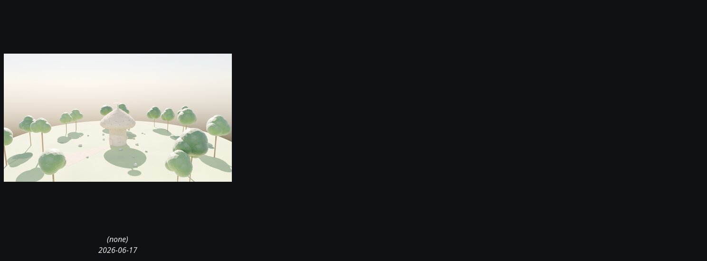

# mushroom_cob_house_hero

Total renders: **1**.

## Coverage by view

| View | Renders |
|---|---:|
| `hero3q` | 1 |
| `elevation` | 0 |
| `plan` | 0 |
| `section` | 0 |
| `interior` | 0 |
| `xray` | 0 |

_Contact sheet above shows up to 9 latest renders, deduped by variant._

Grouped by run (date + tag), then view, then variant.

## (undated) · flat_latest · view=hero3q

| Variant | Path | Size | mtime | Source |
|---|---|---:|---|---|
| `(none)` | [`renders/sub/mushroom_cob_house_hero.png`](../../../renders/sub/mushroom_cob_house_hero.png) | 2.2MB | 2026-06-17 | sub_flat |
