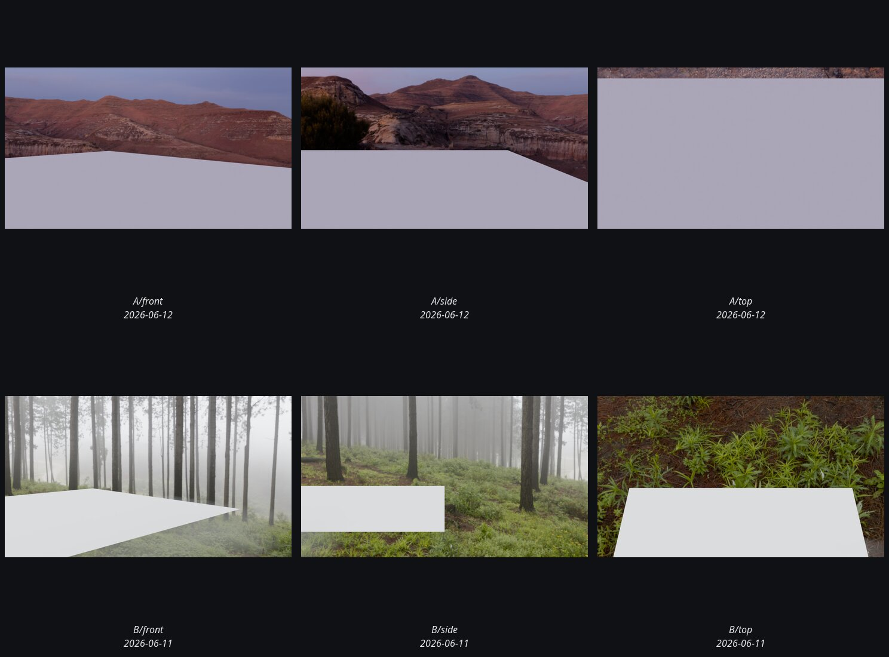

# valley_mist

Total renders: **12**.

_Contact sheet above shows up to 9 latest renders, deduped by variant._

Grouped by run (date + tag), then variant.

## (undated) · sub_latest_mirror · front

| Variant | Path | Size | mtime | Source |
|---|---|---:|---|---|
| `A` | [`renders/sub/latest/valley_mist_front_A.png`](../../../renders/sub/latest/valley_mist_front_A.png) | 3.8MB | 2026-06-12 | sub_latest |
| `B` | [`renders/sub/latest/valley_mist_front_B.png`](../../../renders/sub/latest/valley_mist_front_B.png) | 4.4MB | 2026-06-11 | sub_latest |

## (undated) · sub_latest_mirror · side

| Variant | Path | Size | mtime | Source |
|---|---|---:|---|---|
| `A` | [`renders/sub/latest/valley_mist_side_A.png`](../../../renders/sub/latest/valley_mist_side_A.png) | 3.9MB | 2026-06-12 | sub_latest |
| `B` | [`renders/sub/latest/valley_mist_side_B.png`](../../../renders/sub/latest/valley_mist_side_B.png) | 4.7MB | 2026-06-11 | sub_latest |

## (undated) · sub_latest_mirror · top

| Variant | Path | Size | mtime | Source |
|---|---|---:|---|---|
| `A` | [`renders/sub/latest/valley_mist_top_A.png`](../../../renders/sub/latest/valley_mist_top_A.png) | 2.8MB | 2026-06-12 | sub_latest |
| `B` | [`renders/sub/latest/valley_mist_top_B.png`](../../../renders/sub/latest/valley_mist_top_B.png) | 4.4MB | 2026-06-11 | sub_latest |

## 2026-06-11 · gallery · front

| Variant | Path | Size | mtime | Source |
|---|---|---:|---|---|
| `B` | [`renders/sub/runs/20260611_gallery_real_valley_mist_front/B.png`](../../../renders/sub/runs/20260611_gallery_real_valley_mist_front/B.png) | 4.4MB | 2026-06-11 | sub_run |

## 2026-06-11 · gallery · side

| Variant | Path | Size | mtime | Source |
|---|---|---:|---|---|
| `B` | [`renders/sub/runs/20260611_gallery_real_valley_mist_side/B.png`](../../../renders/sub/runs/20260611_gallery_real_valley_mist_side/B.png) | 4.7MB | 2026-06-11 | sub_run |

## 2026-06-11 · gallery · top

| Variant | Path | Size | mtime | Source |
|---|---|---:|---|---|
| `B` | [`renders/sub/runs/20260611_gallery_real_valley_mist_top/B.png`](../../../renders/sub/runs/20260611_gallery_real_valley_mist_top/B.png) | 4.4MB | 2026-06-11 | sub_run |

## 2026-06-12 · p0_rerender · front

| Variant | Path | Size | mtime | Source |
|---|---|---:|---|---|
| `A` | [`renders/sub/runs/p0_rerender_20260612_valley_mist_front/A.png`](../../../renders/sub/runs/p0_rerender_20260612_valley_mist_front/A.png) | 3.8MB | 2026-06-12 | sub_run |

## 2026-06-12 · p0_rerender · side

| Variant | Path | Size | mtime | Source |
|---|---|---:|---|---|
| `A` | [`renders/sub/runs/p0_rerender_20260612_valley_mist_side/A.png`](../../../renders/sub/runs/p0_rerender_20260612_valley_mist_side/A.png) | 3.9MB | 2026-06-12 | sub_run |

## 2026-06-12 · p0_rerender · top

| Variant | Path | Size | mtime | Source |
|---|---|---:|---|---|
| `A` | [`renders/sub/runs/p0_rerender_20260612_valley_mist_top/A.png`](../../../renders/sub/runs/p0_rerender_20260612_valley_mist_top/A.png) | 2.8MB | 2026-06-12 | sub_run |
